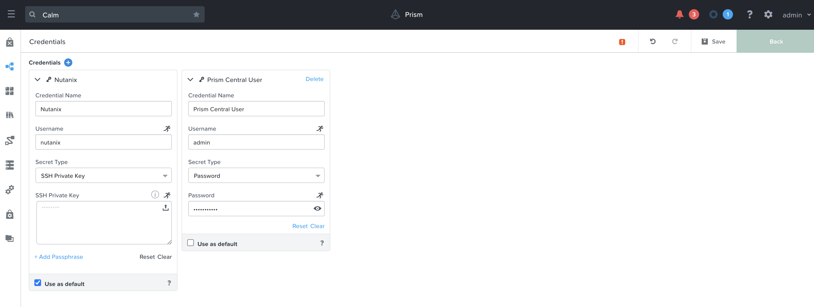

# SE Team training Calm/Karbon 201 Lab
## Objectives
- Create CI/CD environment(SCM, Container registry, Artifact repository, pipeline management) using Nutanix Calm  
- Deploy containerized application on k8s(Karbon) cluster from Nutanix Calm  
- Create Blue-Green deployment using Nutanix Calm  


## Prerequisites
- Kubernetes cluster from Karbon1.0.3  
Metallb configured following to the instruction [here](https://next.nutanix.com/architectural-best-practices-74/utilizing-metallb-to-provide-loadbalancer-services-for-nutanix-karbon-32966)

- Calm2.9  

- kubectl VM(Assigned from trainer, your laptop can also be used if it has the tools below.)  
kubectl  
kubeconfig  
watch  
git  
sshkey file(calmkey)  

- Variables  
YOURNAME: Your Unique Name without spaces (ex: shuchida)

- Instruction  
[KubeVM]: Operate from your kubectl VM  
[CALM]: Operate from Calm GUI  
[Browser]: Operate from your local browser  
[DevWSVM]: Operate from the Developer's workspace VM created from 03_cicd-base.json blueprint  
[Jenkins]: Operate from your Jenkins instance created from 03_cicd-base.json blueprint  

## 1.Create MongoDB Pod from Calm


## 1-1.[KubeVM] Create namespace
```shell
kubectl create ns [YOURNAME]
kubectl get ns
watch kubectl get deploy,po,svc -n [YOURNAME] 
```

## 1-2.[CALM] Login to Calm and upload "01_cicd-mongo.json" blueprint
```shell
Blueprint Name: [YOURNAME]-cicd-mongo
Project: default
Password: nutanix/4u
```


```
Pod --> MongoDBPod --> Deployment
Account: [Karbon provider name]

Push Save button
```


## 1-3.[CALM] Launch mongodb
```shell
Push Launch button
Name of the Application: [YOURNAME]-cicd-mongo
yourname: [YOURNAME]
Push Create button
```


```shell
Note: You can ignore the 3 Warnings.
```


## 1-4.[KubeVM] Check mongodb deployment, pod and service are created
```shell
kubectl get deploy,po,svc -n [YOURNAME]
```
```shell
The output should be something like this.

$ kubectl get deploy,po,svc -n shuchida
NAME                                            READY   UP-TO-DATE   AVAILABLE   AGE
deployment.extensions/k8s-mongodb-deployment    1/1     1            1           9d

NAME                                           READY   STATUS    RESTARTS   AGE
pod/k8s-mongodb-deployment-7b4df64bb7-n9wp7    1/1     Running   0          9d

NAME                              TYPE           CLUSTER-IP       EXTERNAL-IP     PORT(S)          AGE
service/mongodb-calm-lb-service   ClusterIP      172.19.163.5     <none>          27017/TCP        9d
```

## 2.Create CICD toolkit from Calm


### 2-1.[CALM] Upload "02_cicd-app.json" blueprint
```shell
Blueprint Name: [YOURNAME]-cicd-app
Project: default
Password: nutanix/4u
```


```shell
Note: Don't launch the app for now, this app is deployed by Jenkins at later step.
```

### 2-2.[CALM] Upload "03_cicd-base.json" blueprint
```shell
Blueprint Name: [YOURNAME]-cicd-base
Project: default
Password: nutanix/4u

Services:
Developer Workstation --> VM --> NETWORK ADAPTERS (NICS) (1) --> NIC1 --> Select Karbon-Network
Jenkins Slave --> VM --> NETWORK ADAPTERS (NICS) (1) --> NIC1 --> Select Karbon-Network
Jenkins Master --> VM --> NETWORK ADAPTERS (NICS) (1) --> NIC1 --> Select Karbon-Network
Docker Registry --> VM --> NETWORK ADAPTERS (NICS) (1) --> NIC1 --> Select Karbon-Network
Artifactory --> VM --> NETWORK ADAPTERS (NICS) (1) --> NIC1 --> Select Karbon-Network
Gitolite --> VM --> NETWORK ADAPTERS (NICS) (1) --> NIC1 --> Select Karbon-Network
```


### 2-3.[CALM] Launch cicd-base application
```shell
Push Launch Button
Name of the Application: [YOURNAME]-cicd-base

Profile configuration:
- Blueprint Name: [YOURNAME]-cicd-app
- Karbon Cluster Name: Your Karbon cluster name
- Prism Central IP Address: Your PC address
- yourname: [YOURNAME]

Credentials:
- Prism Central User --> Fill out your Prism Central admin user password
```


```
Note: 20-30mins to boot up
```

### 2-4.[CALM] Check CICD environment
```shell
Application --> [YOURNAME]-cicd-base --> Audit --> Create --> OneTimeWorkFlows Start --> Output Connection Details

Jenkins Master Details: memo the output
Docker Registry Details: memo the output
Artifactory Details: memo the output
Developer Workstation Details: memo the output
```


### 2-5.[Browser] Access Jenkins
```shell
Access to Jenkins Master URL as indicated at "Jenkins Master URL"
Username: admin
Password: Shown at "Initial Authorization Password"
```


```shell
You see 2 pipelines, one is devops, the other is devops_deploy

devops: main pipeline to build container images, unit/integration test, call devops_deploy pipeline to deploy and cleanup
devops_deploy: call calm plugin to deploy the container images using [YOURNAME]-cicd-app blueprint
```


### 2-6.[Browser] Access Docker Registry
```shell
Access to Docker Registry URL as indicated at "Docker Registry URLs"
Username: nutanix
Password: nutanix/4u
```


### 2-7.[Browser] Access Artifactory
```shell
Access to Artifactory URL as indicated at "Artifactory URL"
Username: admin
Password: password
```


### 2-8.[DevWSVM] Access Developer Workstation
```shell
Access to developer workstation, ssh to "Developer Workstaion IP Address" using ssh key
ssh -i calmkey nutanix@"Developer Workstation IP Address"
```
```shell
Initial application code has been placed on this workstation.
Move to devops directory and look around 

cd ~/devops
git status
git remote -v

The output should be something like this.
[nutanix@dev-workstation-2193 devops]$ git status
# On branch master
#
# Initial commit
#
# Untracked files:
#   (use "git add <file>..." to include in what will be committed)
#
#	Jenkinsfile
#	Makefile
#	app/
#	db/
#	docker-ansible/
#	docker/
#	target/
#	web/
nothing added to commit but untracked files present (use "git add" to track)
[nutanix@dev-workstation-2193 devops]$ 
[nutanix@dev-workstation-2193 devops]$ 
[nutanix@dev-workstation-2193 devops]$ git remote -v
origin	git@git-server-2598.apjsme.local:devops.git (fetch)
origin	git@git-server-2598.apjsme.local:devops.git (push)
[nutanix@dev-workstation-2193 devops]$ 
```

## 3.Application deployment


### 3-1.[KubeVM] Create services for nginx and nodejs pods
```shell
kubectl apply -f 04_nginx-calm-lb-service.yaml -n [YOURNAME]
kubectl apply -f 05_nodejs-calm-lb-service.yaml -n [YOURNAME]
kubectl get services -n [YOURNAME]
kubectl get services nodejs-calm-lb-service -n [YOURNAME] -o jsonpath='{.status.loadBalancer.ingress[0].ip}'
--> memo the ip address as "NODEJS IP address"
kubectl get services nginx-calm-lb-service -n [YOURNAME] -o jsonpath='{.status.loadBalancer.ingress[0].ip}'
--> memo the ip address as "NGINX IP address"
```

## 3-2.[CALM] Modify [YOURNAME]-cicd-app blueprint
```shell
Open [YOURNAME]-cicd-app blueprint

Pod --> NginxPod --> Deployment
Account: [Karbon provider name]
Pod --> NodeJSPod --> Deployment
Account: [Karbon provider name]
```


```
Application Profile: Default --> Variables:
mgmtvm_address: "Developer Workstation IP Address" fetched at 2-4
pc_instance_ip: Prism Central IP Address
karbon_cluster_name: Your Karbon cluster name
nodejs_ip: IP address of NODEJS address fetched at 3-1
yourname: [YOURNAME]
```


```
Credentials:
Prism Central User --> Fill out your Prism Central admin user password

Push Save button
```



```shell
Note: You can ignore the 15 Warnings.
```


## 3-3.[DevWSVM] Push application code to SCM server to trigger CICD pipeline
```shell
cd ~/devops
git status
git add .
git commit -m "My first commit"
git push origin master

The output should be like this.

[nutanix@dev-workstation-2193 devops]$ git status
# On branch master
#
# Initial commit
#
# Untracked files:
#   (use "git add <file>..." to include in what will be committed)
#
#	Jenkinsfile
#	Makefile
#	app/
#	db/
#	docker-ansible/
#	docker/
#	target/
#	web/
nothing added to commit but untracked files present (use "git add" to track)
[nutanix@dev-workstation-2193 devops]$ 
[nutanix@dev-workstation-2193 devops]$ 
[nutanix@dev-workstation-2193 devops]$ 
[nutanix@dev-workstation-2193 devops]$ git add .
[nutanix@dev-workstation-2193 devops]$ 
[nutanix@dev-workstation-2193 devops]$ 
[nutanix@dev-workstation-2193 devops]$ git commit -m "My first commit"
[master (root-commit) 2721a8f] My first commit
 35 files changed, 11798 insertions(+)
 create mode 100644 Jenkinsfile
 create mode 100644 Makefile
 create mode 100644 app/docker/dev/Dockerfile
 create mode 100644 app/docker/dev/docker-compose.yml
 create mode 100755 app/src/app.js
 create mode 100644 app/src/models/peakModel.js
 create mode 100644 app/src/package.json
 create mode 100644 app/src/routes/infoRoutes.js
 create mode 100644 app/src/routes/peakRoutes.js
 create mode 100644 app/tests/package.json
 create mode 100644 app/tests/test.js
 create mode 100644 db/mongo/data/collections.json
 create mode 100644 db/mongo/docker/dev/Dockerfile
 create mode 100644 db/mongo/docker/dev/docker-compose.yml
 create mode 100644 docker-ansible/src/Dockerfile
 create mode 100644 docker-ansible/src/ansible/probe.yml
 create mode 100644 docker/dev/Dockerfile
 create mode 100644 docker/dev/docker-compose.yml
 create mode 100644 docker/release/docker-compose.yml
 create mode 100644 target/seed
 create mode 100644 web/bin/nginx-startup.sh
 create mode 100644 web/docker/dev/Dockerfile
 create mode 100644 web/docker/dev/docker-compose.yml
 create mode 100644 web/src/css/bootstrap-grid.min.css
 create mode 100644 web/src/css/bootstrap.min.css
 create mode 100644 web/src/css/style.css
 create mode 100644 web/src/images/Nutanix-neg.png
 create mode 100644 web/src/images/Nutanix_X.png
 create mode 100644 web/src/images/nutanix-x-2.png
 create mode 100644 web/src/images/nutanix_logo.png
 create mode 100644 web/src/images/search.png
 create mode 100644 web/src/index.html
 create mode 100644 web/src/js/bootstrap.bundle.min.js
 create mode 100644 web/src/js/data.js
 create mode 100644 web/src/js/jquery-3.2.1.js
[nutanix@dev-workstation-2193 devops]$ 
[nutanix@dev-workstation-2193 devops]$ 
[nutanix@dev-workstation-2193 devops]$ 
[nutanix@dev-workstation-2193 devops]$ git push origin master
Counting objects: 64, done.
Compressing objects: 100% (52/52), done.
Writing objects: 100% (64/64), 261.85 KiB | 0 bytes/s, done.
Total 64 (delta 4), reused 0 (delta 0)
To git@git-server-2598.apjsme.local:devops.git
 * [new branch]      master -> master
```

## 3-4.[Jenkins] Check CI/CD pipelines
```shell
Click devops pipeline, you should see whole pipeline is loaded and executed.
```


```shell
Click devops_deploy pipeline, you should see deployment task is completed.
```


## 3-5.[KubeVM] Check kubernetes cluster
```shell
kubectl get deploy,po,svc,ep -n [YOURNAME]

The output should be someting like this.

$ kubectl get deploy,po,svc,ep -n shuchida
NAME                                            READY   UP-TO-DATE   AVAILABLE   AGE
deployment.extensions/k8s-mongodb-deployment    1/1     1            1           53m
deployment.extensions/k8s-nginx-deployment-1    2/2     2            2           4m46s
deployment.extensions/k8s-nodejs-deployment-1   1/1     1            1           4m47s

NAME                                           READY   STATUS    RESTARTS   AGE
pod/k8s-mongodb-deployment-7b4df64bb7-n9wp7    1/1     Running   0          53m
pod/k8s-nginx-deployment-1-5988ccbcb8-9dqsg    1/1     Running   0          4m46s
pod/k8s-nginx-deployment-1-5988ccbcb8-t7k95    1/1     Running   0          4m46s
pod/k8s-nodejs-deployment-1-58c98f7655-zb8mf   1/1     Running   0          4m47s

NAME                              TYPE           CLUSTER-IP       EXTERNAL-IP     PORT(S)          AGE
service/mongodb-calm-lb-service   ClusterIP      172.19.163.5     <none>          27017/TCP        52m
service/nginx-calm-lb-service     LoadBalancer   172.19.141.183   10.139.81.162   80:30436/TCP     59m
service/nodejs-calm-lb-service    LoadBalancer   172.19.117.109   10.139.81.163   3000:30983/TCP   59m

NAME                                ENDPOINTS                       AGE
endpoints/mongodb-calm-lb-service   172.20.1.100:27017              52m
endpoints/nginx-calm-lb-service     172.20.1.14:80,172.20.1.15:80   59m
endpoints/nodejs-calm-lb-service    172.20.1.13:3000                59m
```

## 3-6.[Browser] Access the application from browser
```shell
Access the NGINX ip address from web browser fetched at 3-1
Push Search button to display the peak rank.
```


## 3-7.[CALM] Check an application is instanciated
```shell
Check Application field and you'll see something like devopsXXXXJenkins1.
This app is created from [YOURNAME]-cicd-app blueprint launched by Jenkins Calm Plugin.
```


## 3-8.[DevWSVM] Modify application code and push to SCM server to trigger CICD pipeline
```shell
cd ~/devops
sed -i "s/4C4C4E/800080/g" web/src/css/style.css
git status
git diff
git commit -am "Changed the color to #800080"
git push origin master

The output should be something like this.

[nutanix@dev-workstation-2193 devops]$ 
[nutanix@dev-workstation-2193 devops]$ sed -i "s/4C4C4E/800080/g" web/src/css/style.css
[nutanix@dev-workstation-2193 devops]$ 
[nutanix@dev-workstation-2193 devops]$ 
[nutanix@dev-workstation-2193 devops]$ 
[nutanix@dev-workstation-2193 devops]$ git status
# On branch master
# Changes not staged for commit:
#   (use "git add <file>..." to update what will be committed)
#   (use "git checkout -- <file>..." to discard changes in working directory)
#
#	modified:   web/src/css/style.css
#
no changes added to commit (use "git add" and/or "git commit -a")
[nutanix@dev-workstation-2193 devops]$ 
[nutanix@dev-workstation-2193 devops]$ 
[nutanix@dev-workstation-2193 devops]$ git diff
diff --git a/web/src/css/style.css b/web/src/css/style.css
index 925bb70..35f6132 100644
--- a/web/src/css/style.css
+++ b/web/src/css/style.css
@@ -20,7 +20,7 @@
 }
 
 .server-info {
-       background: #4C4C4E;
+       background: #800080;
        color: #fff;
        line-height 28px;
 }
[nutanix@dev-workstation-2193 devops]$ 
[nutanix@dev-workstation-2193 devops]$ 
[nutanix@dev-workstation-2193 devops]$ 
[nutanix@dev-workstation-2193 devops]$ git commit -am "Changed the color to #800080"
[master cfa2ed6] Changed the color to #800080
 1 file changed, 1 insertion(+), 1 deletion(-)
[nutanix@dev-workstation-2193 devops]$ 
[nutanix@dev-workstation-2193 devops]$ 
[nutanix@dev-workstation-2193 devops]$ git push origin master
Counting objects: 11, done.
Compressing objects: 100% (6/6), done.
Writing objects: 100% (6/6), 570 bytes | 0 bytes/s, done.
Total 6 (delta 4), reused 0 (delta 0)
To git@git-server-2598.apjsme.local:devops.git
   2721a8f..cfa2ed6  master -> master
```

## 3-9.[Jenkins] Check CI/CD pipelines
```shell
Click devops pipeline, you should see whole pipeline is loaded and executed.
```


```shell
Click devops_deploy pipeline, you should see deployment task is completed.
```


## 3-10.[KubeVM] Check kubernetes cluster
```shell
kubectl get deploy,po,svc,ep -n [YOURNAME]

The output should be someting like this.
Note new pods are deployed, named XXXXXX-2.

$ kubectl get deploy,po,svc,ep -n shuchida
NAME                                            READY   UP-TO-DATE   AVAILABLE   AGE
deployment.extensions/k8s-mongodb-deployment    1/1     1            1           9d
deployment.extensions/k8s-nginx-deployment-1    2/2     2            2           12m
deployment.extensions/k8s-nginx-deployment-2    2/2     2            2           3m58s
deployment.extensions/k8s-nodejs-deployment-1   1/1     1            1           12m
deployment.extensions/k8s-nodejs-deployment-2   1/1     1            1           3m59s

NAME                                          READY   STATUS    RESTARTS   AGE
pod/k8s-mongodb-deployment-7b4df64bb7-n9wp7   1/1     Running   0          9d
pod/k8s-nginx-deployment-1-7fcdf85ddf-brwps   1/1     Running   0          12m
pod/k8s-nginx-deployment-1-7fcdf85ddf-sp2l6   1/1     Running   0          12m
pod/k8s-nginx-deployment-2-56f477b5b7-szjk2   1/1     Running   0          3m58s
pod/k8s-nginx-deployment-2-56f477b5b7-tc6sr   1/1     Running   0          3m58s
pod/k8s-nodejs-deployment-1-6b7ddc6c4-nfjfv   1/1     Running   0          12m
pod/k8s-nodejs-deployment-2-7c88b7456-snvrc   1/1     Running   0          3m59s

NAME                              TYPE           CLUSTER-IP       EXTERNAL-IP     PORT(S)          AGE
service/mongodb-calm-lb-service   ClusterIP      172.19.163.5     <none>          27017/TCP        9d
service/nginx-calm-lb-service     LoadBalancer   172.19.141.183   10.139.81.162   80:30436/TCP     9d
service/nodejs-calm-lb-service    LoadBalancer   172.19.117.109   10.139.81.163   3000:30983/TCP   9d

NAME                                ENDPOINTS                       AGE
endpoints/mongodb-calm-lb-service   172.20.1.100:27017              9d
endpoints/nginx-calm-lb-service     172.20.1.47:80,172.20.1.48:80   9d
endpoints/nodejs-calm-lb-service    172.20.1.46:3000                9d
```

## 3-11.[Browser] Access the application from browser
```shell
Access the NGINX ip address from web browser fetched at 3-1, the color of server info pane changed to purple.
Push Search button to display the rank.
```


## 3-12.[CALM] Check an application is instanciated
```shell
Check Application field and you'll see another app named like devopsXXXXJenkins2.
This app is created from [YOURNAME]-cicd-app blueprint kicked from Jenkins Calm Plugin.
```


